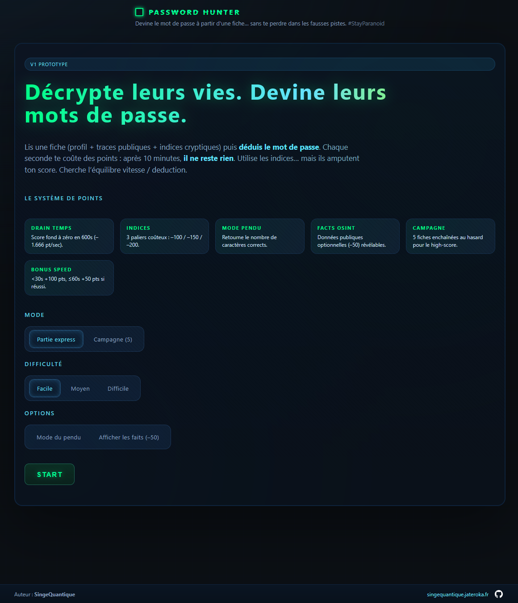
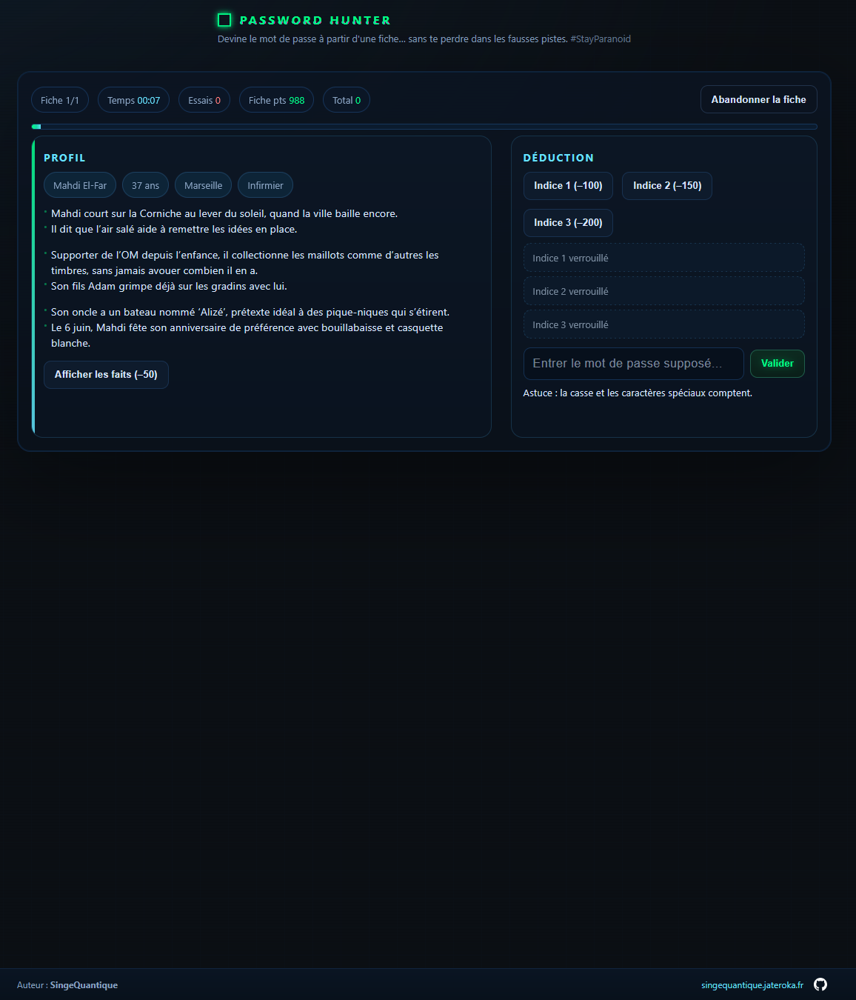
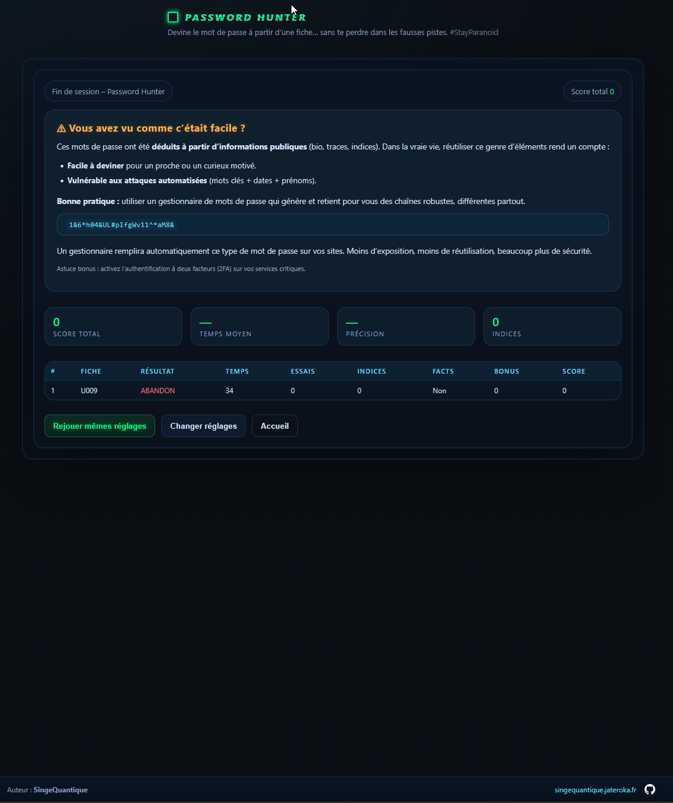

# Password Hunter
[▶️ Tester le jeu en ligne](https://za512.github.io/PasswordHunterGame/)




**Password Hunter** est un jeu d’OSINT (Open Source Intelligence) pour sensibiliser à la faiblesse des mots de passe « devinables ». Le but : deviner le mot de passe d’un profil fictif à partir de ses traces publiques, indices et habitudes… comme le ferait un attaquant ou un collègue trop curieux.

## Pourquoi ce jeu ?

- **Prendre conscience** que beaucoup de mots de passe sont construits à partir d’informations publiques ou faciles à deviner (prénoms, dates, animaux, passions…)
- **Outil de sensibilisation** pour les RSSI, formateurs ou équipes sécurité : faites jouer vos collaborateurs pour illustrer les risques de la réutilisation et du choix de mots de passe faibles.
- **Ludique et pédagogique** : chaque fiche est un mini-cas d’école, avec scoring, indices, et explications en fin de partie.

---

## Modes de jeu

- **Partie express** : devinez un seul mot de passe sur une fiche tirée au hasard.
- **Campagne** : enchaînez 5 fiches pour viser le meilleur score.

### Difficulté
- **Facile** : mot de passe simple (prénom, date, animal…)
- **Moyen** : mot avec séparateur ou symbole léger
- **Difficile** : combinaisons moins évidentes (majuscules, symboles, plusieurs éléments)

### Options
- **Mode du pendu** : affiche le nombre de caractères corrects dans la proposition
- **Afficher les faits** : révèle toutes les données publiques (coût en points)

---

## Fonctionnement

- Lisez la fiche (bio, faits, indices)
- Proposez un mot de passe : chaque essai, indice ou fait coûte des points
- Plus vous trouvez vite, plus le score est élevé
- Un écran de fin récapitule vos stats et rappelle les bonnes pratiques




---

## Sensibilisation et usage RSSI

- **Démonstration concrète** : montrez à vos équipes qu’un mot de passe « personnalisé » n’est pas forcément robuste
- **Débrief** : l’écran de fin explique pourquoi il faut utiliser un gestionnaire de mots de passe et activer le 2FA
- **Aucune donnée réelle** : tout est fictif, pas de collecte ni de stockage




---

## Installation / Lancement

- **Aucune installation requise**
- Téléchargez ou clonez le dépôt
- Ouvrez simplement `intex.html` dans votre navigateur (tout est dans une seule page, pas de dépendance)

```sh
# Clonez le dépôt
 git clone https://github.com/ZA512/PasswordHunterGame.git
 cd PasswordHunterGame

# Ouvrez intex.html dans votre navigateur
 start intex.html  # (Windows)
# ou
 open intex.html   # (Mac)
```

---

## Auteur

[SingeQuantique](https://singequantique.jateroka.fr) – [github.com/ZA512](https://github.com/ZA512)

---

**Licence** : MIT (libre usage, adaptation et diffusion)
